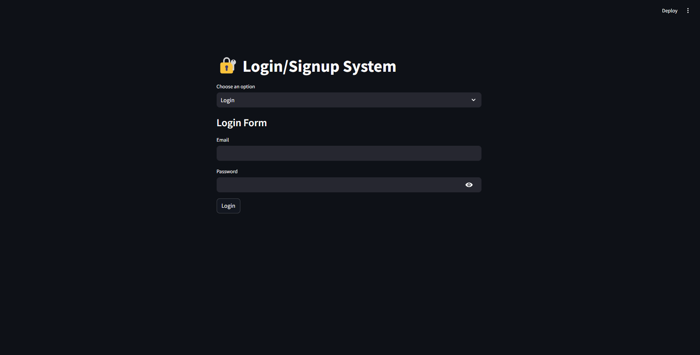
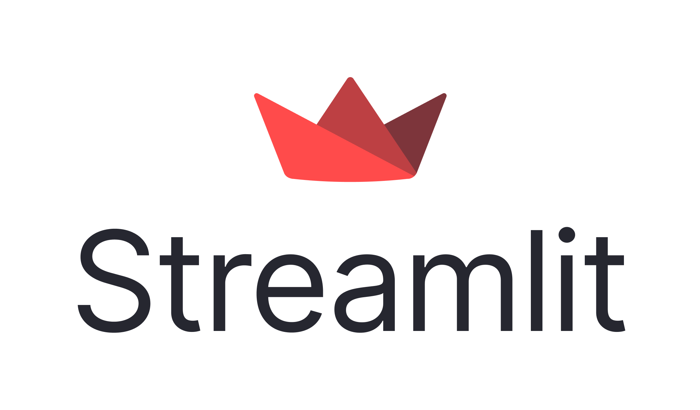
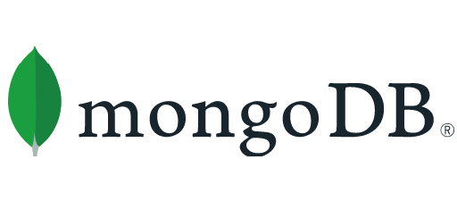

# 🌱 AgroCare — Plant Disease Detection (Streamlit + MongoDB + LLM Agents)

A multi-version Streamlit app (V1, V2, V3) for plant disease **detection, comparison, and history tracking**, backed by **MongoDB** and powered by **multi‑agent LLM analysis**. Includes secure auth (bcrypt) and data persistence for repeatable diagnostics.

---
## ▶️ Demo

<p align="center">
  
        </p>

---

## ✨ Features

- **Three app versions kept for transparency & evolution**
  - **V1 — Plant Disease Detection:** Upload a plant image → get symptoms, likely diseases, and care steps.
  - **V2 — Image Comparison:** Compare two images (e.g., *before vs. after treatment*) → track improvement or spread; results are persisted for future comparisons.
  - **V3 — Scanned Plants & Details:** History view of analyzed plants, detail pages, follow‑up image attachments, and side‑by‑side analysis.
- **Secure Auth** using **bcrypt**:
  - Passwords are **salted + hashed**, verified using constant‑time checks.
  - Login/Signup state managed via cookies; only minimal identifiers stored client‑side.
  - User records persisted in MongoDB.
- **Multi‑Agent Analysis** for higher accuracy:
  - Agents collaborate: *Vision Analyzer* → *Symptom Summarizer* → *Differential Diagnosis* → *Consistency Checker*.
  - Modular provider layer (supports multiple APIs) to ensemble or fallback.
- **MongoDB Persistence**:
  - Image binaries, analyses, and comparisons saved per‑user (owner scoping).
  - Queryable history enables longitudinal tracking and re‑evaluation.
- **Streamlit UX** with caching:
  - `st.cache_resource` for long‑lived resources (DB clients, model clients).
  - `st.cache_data` for deterministic, recomputable results (lookups, small transforms).

---

## 🧰 Tech Stack

<p align="left">
  
  
  
  
  
  
  
        </p>


---

## 🔐 Security

- **Passwords**: hashed with **bcrypt** (salted), verified with `bcrypt.checkpw`.
- **Cookies/Sessions**: store only minimal identifiers (e.g., `uid`), prefer `HttpOnly`, `Secure`, `SameSite=Lax/Strict`.
- **Input validation**: accept only JPEG/PNG, enforce size limits, verify magic bytes.
- **Secrets**: never commit real keys; use `config/secrets.example.toml` template and local `.streamlit/secrets.toml`.
- **Least privilege**: use a scoped MongoDB user (RBAC) and IP allow‑listing where possible.

---

## 🚀 Getting Started

### Prerequisites

- Python 3.10+
- MongoDB Atlas (or local Mongo) connection string

### Clone & Install

```bash
git clone https://github.com/aymenhmaidiwastaken/AgroCare.git
cd AgroCare
python -m venv .venv && source .venv/bin/activate   # Windows: .venv\\Scripts\\activate
pip install -r requirements.txt
```

### Configure Secrets (template → local)

```bash
# copy the example template
mkdir -p .streamlit
cp config/secrets.example.toml .streamlit/secrets.toml

# then edit .streamlit/secrets.toml with your values
[mongodb]
uri = "your-mongodb-uri"

[api_keys]
openai = "sk-..."
# optional providers, if configured
# groq = "..."
# toolhouse = "..."
```

### Run

```bash
streamlit run app.py
```

Use the sidebar to switch between **V1 / V2 / V3**.

---

## 🧪 Multi‑Agent Pipeline (high level)

1. **Vision Analyzer** extracts salient features from the image (spots, color changes, leaf curl).
2. **Symptom Summarizer** condenses features into a structured list.
3. **Differential Diagnosis** proposes 1–2 likely diseases with confidence levels.
4. **Consistency Checker** verifies plausibility and flags contradictions.
5. **Persistence** writes final analysis/trace to MongoDB for future review.

Each step can target different APIs/models and ensemble results for robustness.

---

## 📦 Project Layout

```
AgroCareApp/
├─ app.py                      # main Streamlit entry (routes to V1/V2/V3)
├─ V1/                         # Plant Disease Detection
│  └─ app1.py
├─ V2/                         # Image Comparison
│  └─ app2.py
├─ V3/                         # Scanned Plants / Details
│  └─ app3.py
├─ assets/
│  ├─ demo.gif                 # your showcase GIF
│  └─ icons/                   # tech logos (svg/png)
├─ config/
│  └─ secrets.example.toml     
├─ requirements.txt
├─ .gitignore
└─ README.md
```

---

## 🗺️ Roadmap

- Role‑based access (admin/user)
- GridFS for large images
- Structured JSON outputs for analyses (Pydantic)
- Model confidence calibration & uncertainty display
- Batch comparisons and alerts ("notify me if worsening")

---

## 🤝 Contributing

Pull requests welcome. If you find a bug or security issue, please open an issue or email us (see `SECURITY.md` for responsible disclosure).

---

